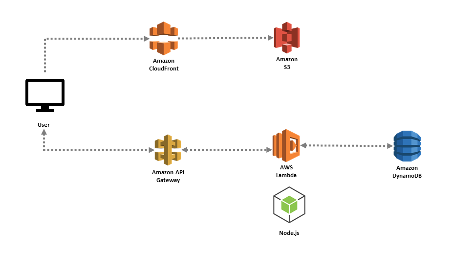

# serverless-waf-demo
Use of WAF to restrict access to S3 Objects via Cloudfront and API Gateway 

To secure your application resources, futher than authentication with Cognito, IP whitelisting may be required. 

This is a demo repo on how to acheive whitelisting to secure your serverless apps. This demo assumes you already have an understanding of using S3 to serve your applications. And understand the following AWS Services

    AWS S3
    AWS Cloudfront
    AWS Cloudformation
    AWS WAF
    AWS Route53

The demo solution is an application which is hosted from AWS S3, which makes calls to an API Gateway + Lambda + DynamoDB stack to present data within the application.

When you serve your apps from AWS S3, rather than opening up the bucket to the world, you can configure your bucket policy to only allow access to resources from your Cloudfront distribution using a [CloudFrontOriginAccessIdentity](https://docs.aws.amazon.com/AWSCloudFormation/latest/UserGuide/aws-resource-cloudfront-cloudfrontoriginaccessidentity.html)

You can then attach WAF to Cloudfront to only allow access, once your defined rules have been satisfied.

The API which the App uses, can also have an WAF attached to it to restrict access (it's advised that the api is authenticated)

This demo makes use of a Serverless plugin called `serverless-associate-waf` to associate the WAF to your API Gateway endpoints, and `serverless-s3-sync` to sync the application into S3.